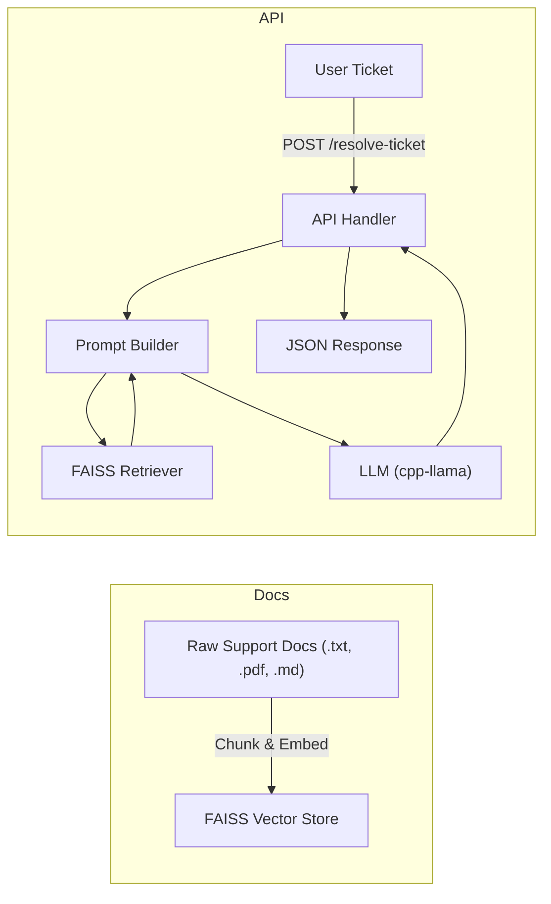

# Document Ingestion & FAISS Pipeline

This diagram shows how raw support documentation is processed and stored in the FAISS vector store. It illustrates the chunking, embedding, and retrieval workflow, as well as how the API interacts with the LLM.

