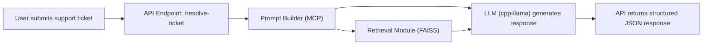

# API Flow from User to Response

This diagram illustrates the end-to-end flow of a support ticket from submission to the MCP-compliant JSON response. It shows the interactions between the API endpoint, retrieval module, prompt builder, and the LLM.

